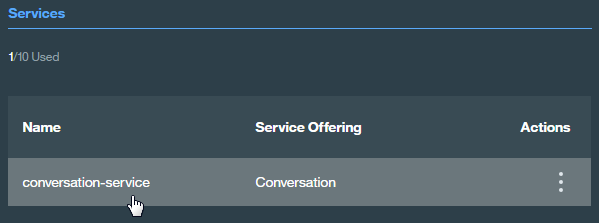

## Before you begin

* Create a Bluemix account
    * [Sign up][sign_up] in Bluemix, or use an existing account. Your account must have available space for at least 1 app and 1 service.
* Make sure that you have the following prerequisites installed:
    * The [Node.js](https://nodejs.org/#download) runtime, including the [npm][npm_link] package manager
    * The [Cloud Foundry][cloud_foundry] command-line client

      Note: Ensure that you Cloud Foundry version is up to date

## Installing locally

### Getting the files

Use GitHub to clone the repository locally, or [download the .zip file]
this is available at discover-cebu.mybluemix.net

### Importing the Conversation workspace

1. In your browser, navigate to [your Bluemix console] (https://console.ng.bluemix.net/dashboard/services).

1. From the **All Items** tab, click the newly created Conversation service in the **Services** list.

    

1. On the Service Details page, click **Launch tool**.

1. Click the **Import workspace** icon in the Conversation service tool. Specify the location of the workspace JSON file in your local copy of the app project:

    `<project_root>/training/cebu_guide.json`

1. Select **Everything (Intents, Entities, and Dialog)** and then click **Import**. The car dashboard workspace is created.

### Configuring the app environment

1. Copy the `.env.example` file to a new `.env` file.

1. Create a service key in the format `cf create-service-key <service_instance> <service_key>`. For example:

    ```bash
    cf create-service-key my-conversation-service myKey
    ```

1. Retrieve the credentials from the service key using the command `cf service-key <service_instance> <service_key>`. For example:

    ```bash
    cf service-key my-conversation-service myKey
    ```

   The output from this command is a JSON object, as in this example:

    ```JSON
    {
      "password": "87iT7aqpvU7l",
      "url": "https://gateway.watsonplatform.net/conversation/api",
      "username": "ca2905e6-7b5d-4408-9192-e4d54d83e604"
    }
    ```

1. Paste  the `password` and `username` values (without quotation marks) from the JSON into the `CONVERSATION_PASSWORD` and `CONVERSATION_USERNAME` variables in the `.env` file. For example:

    ```
    CONVERSATION_USERNAME=ca2905e6-7b5d-4408-9192-e4d54d83e604
    CONVERSATION_PASSWORD=87iT7aqpvU7l
    ```

1. In your Bluemix console, open the Conversation service instance where you imported the workspace.

1. Click the menu icon in the upper-right corner of the workspace tile, and then select **View details**.

    

1. Click the  icon to copy the workspace ID to the clipboard.

1. On the local system, paste the workspace ID into the WORKSPACE_ID variable in the `.env` file. Save and close the file.

### Installing and starting the app

1. Install the demo app package into the local Node.js runtime environment:

    ```bash
    npm install
    ```

1. Start the app:

    ```bash
    npm start
    ```

1. Point your browser to http://localhost:3000 to try out the app.


HAHAHHAHAH CHAR CHAR OMG 
